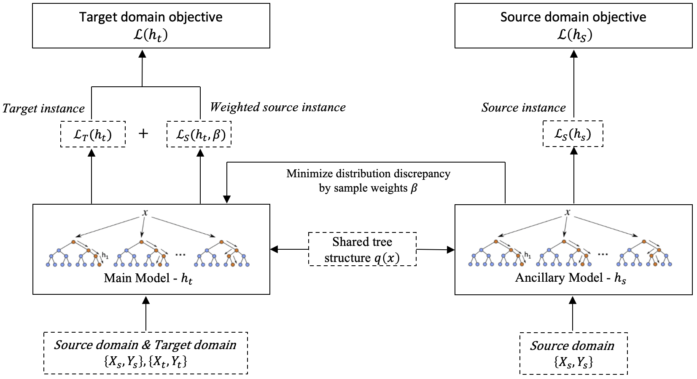

@ Code for Paper: "TransBoost: A Boosting-Tree Kernel Transfer Learning Algorithm for Improving Financial Inclusion" submitted to AAAI'22


### 1. Overview
TransBoost is a tree-kernel-based transfer learning algorithm. It's specially designed for commercial contexts with tabular dataset, and has been proved to be effective, robust and interpretable in real-world transfer learning tasks.

The target of the TransBoost algorithm is to leverage the instances from matured product to improve model performance on target domain. The algorithm is an innovative transfer learning framework of two parallel boosting-tree models that share identical tree structures but different node weights.The special design keeps the merit properties of robustness and interpretability of tree-based models. Besides, it enables us to train classifier and adjust distributional differences between domains simultaneously in O(n) complexity, which is much more efficient than traditional kernel method.





### 2. Environment Requirement:
    Python: 3.6/3.7
    XGBoost: 1.4.2
    Pandas: 1.2.4

### 3. How to Install TransBoost?
TransBoost algorithm is implemented based on the source code of XGBoost. You can find the orginal code of XGBoost on https://github.com/dmlc/xgboost).

To install the algorithm:
	`python3 install.py`

### 4. How to build a TransBoost model?
We provide an example code on two public dataset `LendingClub` and `UCI WineQuality`. Please refer to `Transboost_example.ipynb`: 

    "Experiment 1: Public Benchmark - Lending Club" 

    "Experiment 2: Public Benchmark - Wine Quality"

Input: features and labels of source domain and target domain

Output: classification model for target domain

### 5. How to optimize hyper-parameters for TransBoost model?
TransBoost is a transfer learning algorithm based on GBDT. Please refer to "https://xgboost.readthedocs.io/en/stable/parameter.html " for the hyper-parameters for GBDT. 

The additional parameters for tranfer learning are as follows: 

| Parameter | Explaination | Type|Default value |
| :--- | :--- | :---: | :--- |
| transfer_decay_ratio | Balancing weight for source and target domian | float| 1.0 |
| transfer_rebalance | Normalized sample weight| bool| False|
| transfer_margin_estimation |Optimization method for  objective funciton | string |"secondorder"|
| transfer_min_leaf_size | Minimal leaf size for source domain|  float| 1.0 |
| transfer_prior_margin | Estimation method for marginal distribution|  string| "mirror" |
| transfer_velocity | Transfer momentum (experimental) |  float| 1.0 |

### 6. How to Uninstall TransBoost? 
To uninstall transfer, you need simply reinstall XGBoost by:

    `pip3 install --force-reinstall xgboost`

### 7. Citation
If you find TransBoost useful in your research or work, please consider citing:
```
@misc{sun2021transboost,
      title={TransBoost: A Boosting-Tree Kernel Transfer Learning Algorithm for Improving Financial Inclusion}, 
      author={Yiheng Sun and Tian Lu and Cong Wang and Yuan Li and Huaiyu Fu and Jingran Dong and Yunjie Xu},
      year={2021},
      eprint={2112.02365},
      archivePrefix={arXiv},
      primaryClass={cs.LG}
}
```

### Notes:
Please note the code works perfectly in Linux and MacOS; But if you are using Windows, please mannually replace the source code of XGBoost with files in `TransBoost`. 
